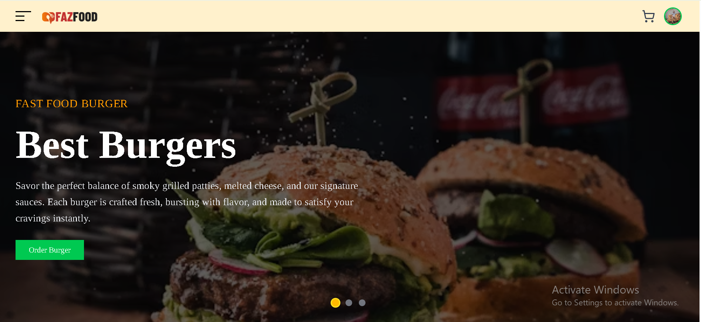
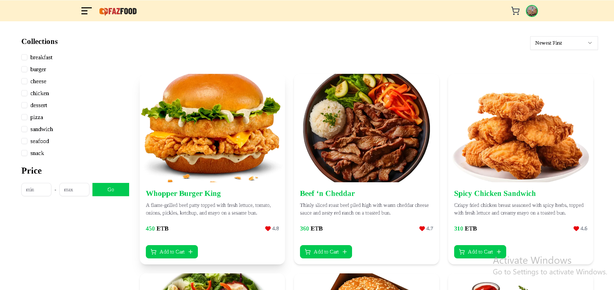
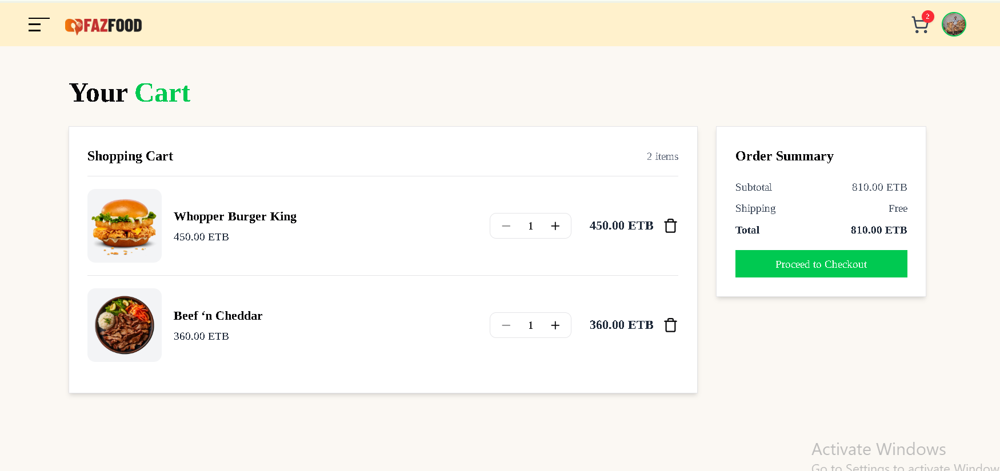
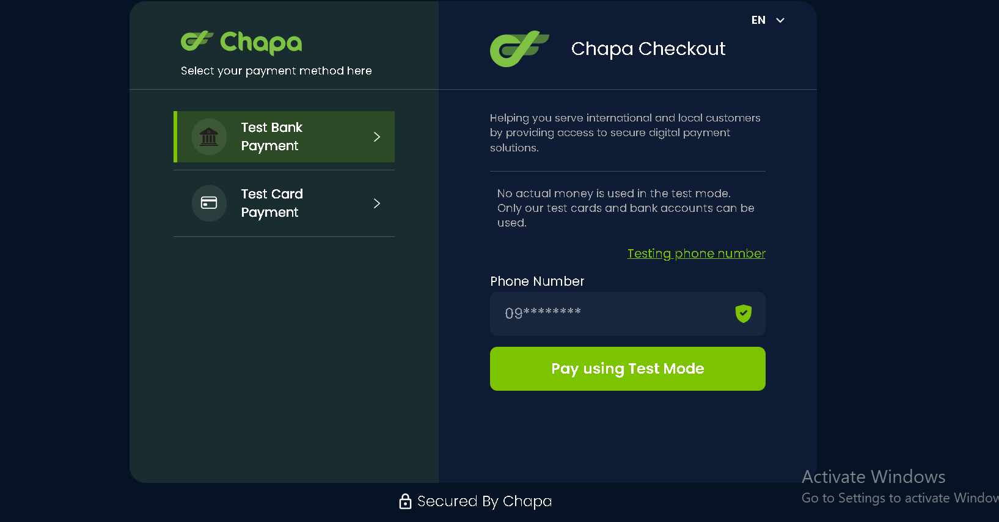

# 🍔 FastFood — Modern Food Ordering Web App

<p align="center">
  
</p>

<p align="center">
  <b>FastFood</b> is a modern, full-stack <b>Food Ordering Website</b> built using the <b>MERN Stack</b> — <b>Next.js 14</b>, <b>Express</b>, <b>MongoDB</b>, and <b>Tailwind CSS</b>.  
  It lets users browse dishes, manage their cart, handle delivery addresses, and make secure online payments.
</p>

<p align="center">
  <a href="https://fast-foods-eight.vercel.app/"></a>
  <a href="https://nextjs.org/"></a>
  <a href="https://expressjs.com/"></a>
  <a href="https://www.mongodb.com/"></a>
  <a href="https://tailwindcss.com/"></a>
</p>

---

## 🚀 Live Demo

👉 **[View the Live Site](https://fast-foods-eight.vercel.app/)**  
⚡ Hosted on **Vercel (Frontend)** + **Render (Backend)** + **MongoDB Atlas (Database)**

---

## 🧰 Tech Stack

| Layer | Technology | Description |
|:------|:------------|:------------|
| 🖥️ Frontend | **Next.js 14 (App Router)** | React-based framework for SSR/SSG |
| 🎨 UI Library | **Tailwind CSS + shadcn/ui + Framer Motion** | Clean, modern, and animated UI |
| ⚙️ State Management | **Zustand / React Query** | Lightweight and efficient state control |
| 🧩 Backend | **Express.js + Node.js** | RESTful API for app logic |
| 🗄️ Database | **MongoDB + Mongoose** | Fast, flexible NoSQL data storage |
| 🔒 Authentication | **JWT / NextAuth** | Secure user authentication |
| 💳 Payment | **Stripe API** | Seamless checkout experience |
| ☁️ Deployment | **Vercel + Render + MongoDB Atlas** | Full cloud hosting |

---

## ✨ Features

### 👤 User Features
- 🍔 Browse categories & dishes
- 🛒 Add to cart and adjust quantities
- 🚚 Manage and save shipping addresses
- 💳 Secure online payment via Stripe
- 📜 View order history & order tracking

### 🧑‍💼 Admin Features
- 📦 Manage dishes, prices, and availability
- 🧾 Manage orders and delivery status
- 🧍 Manage users & access control

### 🌟 General
- ⚡ Server-Side Rendering for speed
- 🛡️ Secure authentication and API routes
- 📱 Fully responsive for mobile & desktop
- 🧠 State-managed cart & checkout flow

---

## 📸 Screenshots

| 🏠 Home Page | 🍟 Menu | 🛒 Cart Summary |
|:-------------|:---------|:----------------|
|  |  |  |

| 💳 Checkout 
|:-------------|:----------|:----------|
|  |  

> 🖼️ Add your screenshots to `/public/screenshots/` for them to render correctly on GitHub.

---

## ⚙️ Getting Started

Follow these steps to set up **FastFood Web App** locally 👇

### 1️⃣ Clone the Repository

```bash
git clone https://github.com/your-username/fastfood.git
cd fastfood

# Install backend dependencies
cd service
npm install

# Install frontend dependencies
cd ../client
npm install

###  Backend (service/.env):
NEXT_PUBLIC_API_URL=[your host](http://localhost:3000)
NEXTAUTH_URL=http://localhost:3000
AUTH_GOOGLE_ID=your google auth_id
AUTH_GOOGLE_SECRET= your AUTH_GOOGLE_SECRET
NEXTAUTH_SECRET=your NEXTAUTH_SECRET
